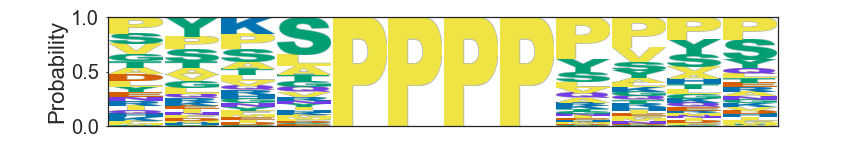
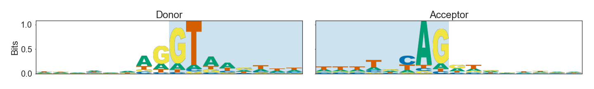

# Matplotlib Logo

A simple, extensible library for plotting DNA/RNA/Protein Sequence logos with matplotlib.
Does probability and bits logos.

## Installation:

```
git clone https://github.com/mparker2/matplotlib_logo.git
cd matplotlib_logo
python setup.py install
```

## Examples:

See examples/logo_example.ipynb to get idea of how to make these



